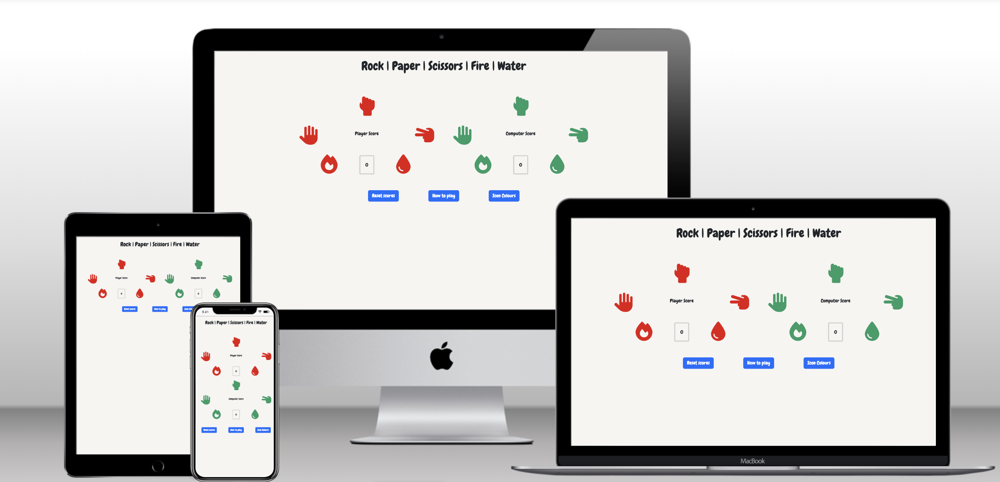
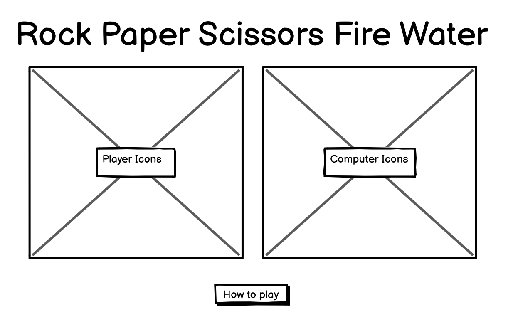

# Rock Paper Scissors Fire Water

[View deployed site](https://krisjowen.github.io/rockpaperscissorsfirewater/)

Rock Paper Scissors Fire Water is an extension of the traditional Rock Paper Scissors game, introducting two new options in Fire and Water. There appear to be few options to play this online so there is a clear benefit to producint this version of the game.

# UX

## Strategy

The user stories were defined as follows:

- As a user unfamiliar with Rock, Paper, Scissors, Fire, Water, I would like to be able to read the rules on how to play the game within the site
- As a user I would like to be able to play the game against the computer

The acceptance criteria were outlined as below:

- The rules on how to play the game are easily accessible at any point
- Games are able to played against the computer

## Scope

The mvp for this iteration of the project is that games are able to be played against the computer and the rules to be accessible. The scope, therefore, should be simple at this point in that the site should not need any additional pages or functionality. It is foreseen that the game will be available on initial page load with the rules either readily avalable or only a click away.

## Structure

The structure will be a simple one page site with a modal for the rules and the gameplay front and centre.

## Skeleton

## Surface

A simple, clean design is all that is required here.

### Font

A playful font will be used to reflect the fact that it is a game being played. 

### Colours

The majority of the page will be a simple black and white layout. However, the icons used for gameplay can be given colour to highlight them.

# Features

## Existing Features

### Gameplay

- Users are presented straight into the gameplay upon loading the page
- Choices are made simply by clicking the desired icon for each move
- The computer choice is then immediately made 
- A label in each corresponding shows which move each player made
- After each turn, text at the top of the page details the outcome of the round
- There is a scorebox for each player to show the progress of the overall game
- The Reset Scores button allows the score to be reset at any point
- The cursor will become a pointer over each player icon to show they are clickable
- Additionally, the player icons will pulse when the mouse is over them to further highlight they are interactive

### Colour Options

- Bold default colours have been chosen to make for clear visibility
- The option has been given for users to choose the colour of the icons for each player
- Being able to choose the icon colour increases accessbility by allowing the game to be tailored for different visual conditions

### How to play

- A how to play button brings up a modal showing the different game outcomes
- This is kept simple to only show the rules with the trust being that the gameplay itself is intuitive and simple

## Future improvements

### Gameplay Options

To provide further gameplay options it would be a nice addition to include 'best of' options, such as best of 3, 5, 7 and so on. Alternatively, this could be labelled as 'first to'. These options would add some purpose to the gameplay rather than an endless gameplay loop that is currently available.

### Limiting Colour Choices

The ability for the user to change the colours of the icons has been implemented. A potential downside to this is readability as some choices can make the icons hard to see or even invisible against the background colour. Giving preset colour options would get around this. A different solution could be to allow the user to also select a background or even text colour.

### Improve Computer Choice Logic

In this iteration of the game the computer choice picks randomly from the five options. However, the Wikipedia entry for this game ([Rock_paper_scissors#Different_rules](https://en.wikipedia.org/wiki/Rock_paper_scissors#Different_rules)) lists that the optimal strategy for the game is to pick rock, paper and scissors each a ninth of the time and fire and water a third of the time. Introducing this choice balancing could make for more interesting and varied gameplay.

# Technologies Used

- [HTML](https://html.spec.whatwg.org/)
- [CSS](https://www.w3.org/TR/CSS/#css)
- [Javascript](https://developer.mozilla.org/en-US/docs/Web/JavaScript)
- [Jest](https://developer.mozilla.org/en-US/docs/Web/JavaScript) - used to create a testing suite
- [Bootstrap](https://getbootstrap.com/) - Bootstrap was utilised for various aspects including, but not limited to, the nav bar, carousel, form and member profile cards
- [Google Fonts](https://fonts.google.com/specimen/Abel) - the Abel and Macondo Google fonts have been used throughout this project
- [Font Awesome](https://fontawesome.com/) - the social icons in each page's footer are from Font Awesome
- [Balsamiq](https://balsamiq.com/) - the wireframes for this project were constructed using Balsamiq
- [Git](https://git-scm.com/) - Git was utilised for version control via Gitpod
- [Github](https://www/github.com) - utilised to store the various versions of the project uploaded via Gitpot  
- [Auto Prefixer](https://autoprefixer.github.io/) - this site helps with browser compatibility by adding different browser prefixed to the style.css file where required
- [Techsini] (https://techsini.com/multi-mockup/index.php) - provided the responsive view of the site on multiple devices within the README file

# Testing

## Code Validation

The page was put through these validation tools

[HTML Validator](https://validator.w3.org/nu/#textarea)

It returned a warning on this page due to an empty H2 heading. This is intentionally empty on initial page load as it displays the outcome of each round once it has concluded.

[CSS Validator](https://jigsaw.w3.org/css-validator/validator)

No errors or warnings were shown for the CSS file

## Gameplay

Manual testing of the gameplay has been thoroughly done to cover the below points

- Player moves are registered
- The computer can randomly generate a move
- The outcome is correctly generated dependent on the two moves chosen
- The score increments correctly based on the outcome

This manual testing has shown that the above all operate successfully regardless of different scenarios.

## Buttons

### Reset Scores

This button has the sole purpose of setting each players' scores to 0 when clicked and manual testing has shown it to work correctly

### How to play

This button prompts a modal to open with a table showing the different potential gameplay outcomes. The modal itself also contains a close button and both of these buttons operate correctly

### Icon Colours

The button here also opens a modal, this time with options to change either players' icon colour. Different browsers show different ways of choosing the colour but each works correctly. 

## Jest

A suite of Jest tests have been built to automate testing of the game. These are detailed below

!!!!!!

## Responsiveness

The site has been loaded in various browsers at different browser sizes and using dev tools to emulate mobile devices. Additionally, it has been loaded on a Google Pixel 6 and has shown to be responsive across all environments.

## Lighthouse

A lighthouse test via the Chrome browser returned the below results using https://krisjowen.github.io/rockpaperscissorsfirewater/

- Performance of 99
- Accessibility of 100
- Best Practices of 100

## Browser Compatibility

The site was tested in Chrome, Firefox and Safari and operated correctly in each. Due to how each site handles the html input of 'color' there are variations in how the 'Icon Colours' section appears across each browser but it functions successfully regardless.

# Deployment

## Deploying to Github Pages

The project was monitored by utilising the Github pages feature. This was created using the below steps:

1. From the [main project page](https://github.com/krisjowen/rockpaperscissorsfirewater), click on the settings tab
2. Choose 'Pages' from the menu on the left
3. Under Build and Deployment and then Branch, main and then root were selected and the options saved
4. Once created, from the main project page again there is a 'Deployments' option on the right hand menu. This shows the URL for the Github Page

## Cloning Project

Details of this can be found on Github's own [documentation](https://docs.github.com/en/repositories/creating-and-managing-repositories/cloning-a-repository)

1. Within Github, navigate to the [main page](https://github.com/krisjowen/rockpaperscissorsfirewater) of the repository
2. Above the list of files, click on the green 'Code' button
3. For HTTPS integrations, copy the web url given under the 'Local' tab
4. Within your terminal, navigate to the desired file path. 
5. Type git clone then paste the code that has been copied (https://github.com/krisjowen/rockpaperscissorsfirewater.git) and hit enter
6. Any changes pushed to the main branch will automatically push to the deployed version

# Credits

The project made use of a template offered by Code Institute to preinstall some tools. The details of this can be found [here](https://github.com/Code-Institute-Org/ci-full-template)
